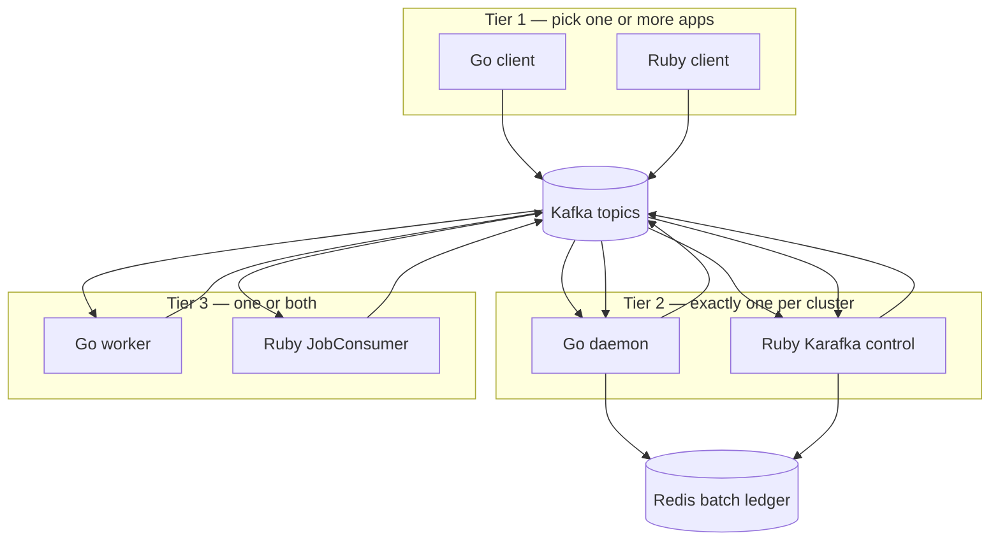

# kafka-batch-go

[](https://github.com/y-shashank/kafka-batch-go/actions/workflows/ci.yml)
[](https://github.com/y-shashank/kafka-batch-go/actions/workflows/ci.yml)

Go implementation of [KafkaBatch](https://github.com/y-shashank/kafka-batch) — Sidekiq Pro Batches on Kafka. Install as a library in your Go services or run the bundled `kbatch` CLI.

Wire-compatible with the Ruby gem: same Redis batch keys, job JSON envelope, handler manifest, schedule index, and uniq fingerprints.

## Three tiers

Each tier is an independently deployable process. Pick **Go or Ruby per tier** in a mixed deployment; tiers communicate only via **Kafka + Redis** (same batch ledger, job envelope, and handler manifest).

| Tier | Go | Ruby |
|------|-----|------|
| **1 — Client** | `pkg/client` | `KafkaBatch::Batch` in the [kafka-batch](https://github.com/y-shashank/kafka-batch) gem |
| **2 — Control** | `kbatch daemon` / `pkg/daemon` | Karafka control groups (`EventConsumer`, `RetryConsumer`, fair dispatch/forward, schedule poller) |
| **3 — Execution** | `kbatch worker` / `pkg/worker` | Karafka `JobConsumer` on ruby job topics + `fair_*_ready.ruby` |

**Rules for mixing:**

- **One control plane per cluster** — run either Go daemon *or* Ruby Karafka control, not both on the same topics (they would double-consume).
- **Client is per app** — a Go API and a Rails app can both enqueue jobs; routing is driven by the shared handler manifest.
- **Execution can be both** — run Go workers and Ruby JobConsumers side by side; each handler's `runtime` in the manifest decides which topic and worker fleet receives the job.
- **Same batch, mixed runtimes** — one batch can contain both `runtime: go` and `runtime: ruby` jobs; control finalizes the batch when all legs complete.



## Mixed-runtime deployment

The handler manifest is the routing contract. Every producer (Go or Ruby) and every control/execution process loads the same `kafka_batch_handlers.yml`:

```yaml
handlers:
  segment.export:
    runtime: go
    topic: segment.exports          # Go worker consumes this
  orders.process:
    runtime: ruby
    worker_class: Orders::ProcessWorker
    topic: kafka_batch.jobs.ruby    # Ruby JobConsumer consumes this
  campaigns.send:
    runtime: go
    fairness_type: time             # fair ingest → control forwards to ready.go / ready.ruby
```

Plain jobs go straight to the handler topic. Fair jobs go to shared **ingest** topics; control forwards to `fair_*_ready.go` or `fair_*_ready.ruby` based on `runtime`.

### Deployment patterns

| Pattern | Client | Control | Execution | Typical use |
|---------|--------|---------|-----------|-------------|
| **All Go** | Go | Go daemon | Go worker | New Go services, lowest ops surface |
| **Go control + mixed exec** | Go or Ruby | Go daemon | Go worker **+** Ruby JobConsumer | Migrate handlers one at a time; most common hybrid |
| **Ruby control + Go exec** | Go or Ruby | Ruby Karafka control | Go worker | Keep Ruby control plane; move hot handlers to Go |
| **All Ruby** | Ruby | Ruby Karafka control | Ruby JobConsumer | Legacy Rails-only stack |

### Example: Go control + mixed execution (recommended hybrid)

Deploy three process types plus optional Ruby callback consumer:

```bash
# 1 — Control (single replica set; scale horizontally with same consumer group)
kbatch daemon --config config/daemon.yml --manifest config/kafka_batch_handlers.yml

# 2 — Go execution (handlers registered via kbatch.Register in your worker main)
kbatch worker --config config/daemon.yml --manifest config/kafka_batch_handlers.yml

# 3 — Ruby execution (Karafka JobConsumer on ruby topics from the gem)
bundle exec karafka server --include-consumer-groups "${CG}-jobs,${CG}-jobs-fair-time"
```

Go and Ruby APIs both enqueue via their respective clients using the **same manifest and Redis URL**. A single batch can push Go and Ruby jobs; the batch completes when every job emits a success/failure event and control updates the ledger.

### Example: Ruby control + Go worker

Use Ruby Karafka for tier 2 only; keep Go for execution on `runtime: go` handlers:

```bash
# Ruby control — events, retry, fair dispatch/forward, schedule poller
bundle exec karafka server --include-consumer-groups \
  "${CG}-control,${CG}-dispatch-time,${CG}-dispatch-throughput"

# Go worker — plain + priority + fair ready.go topics
kbatch worker --config config/daemon.yml --manifest config/kafka_batch_handlers.yml
```

Go `pkg/client` (or Ruby `KafkaBatch::Batch`) produces jobs identically; Ruby `EventConsumer` drives batch completion.

### What must stay aligned across tiers

| Shared resource | Why |
|-----------------|-----|
| `kafka_batch_handlers.yml` | Routes `job_type` → runtime, topic, retries |
| Redis URL | Batch ledger, uniq locks, fair scheduler state |
| Topic names / `KAFKA_PREFIX` | Producers and consumers must agree |
| Events / retry / fair ingest topics | Control plane wiring |

## Install

```bash
go get github.com/y-shashank/kafka-batch-go/pkg/client
go get github.com/y-shashank/kafka-batch-go/pkg/daemon
go get github.com/y-shashank/kafka-batch-go/pkg/worker
go get github.com/y-shashank/kafka-batch-go/pkg/kbatch
```

## Tier 1 — Client library

```go
import "github.com/y-shashank/kafka-batch-go/pkg/client"

cfg := client.DefaultConfig()
cfg.Brokers = []string{"localhost:9092"}
cfg.RedisURL = "redis://localhost:6379/0"
cfg.ManifestPath = "config/kafka_batch_handlers.yml"

c, err := client.New(cfg)
defer c.Close()

// Standalone job (routes ruby or go runtime via manifest)
_, _ = c.EnqueueJob(ctx, "orders.process", map[string]interface{}{"id": 1}, client.PushOptions{})

// Batch — callback_args are passed only to on_success / on_complete handlers (not work jobs)
_, _ = c.CreateBatch(ctx, client.BatchOptions{
    OnComplete:   "MyCallback",
    Meta:         map[string]interface{}{"source": "api"},              // batch metadata only
    CallbackArgs: map[string]interface{}{"run_id": "42", "channel": "#ops"},
}, func(b *client.Batch) error {
    _, err := b.PushJob(ctx, "orders.process", map[string]interface{}{"id": 1}, client.PushOptions{})
    return err
})
```

`meta` is stored on the batch hash for dashboards and APIs. `callback_args` is stored separately and included in callback job payloads / legacy callback messages — work jobs never see it.

## Batches & callbacks

When a batch finalizes, kafka-batch enqueues callback jobs (or legacy Ruby class callbacks) with a batch summary payload. Use `BatchOptions.CallbackArgs` for custom data your callback handler needs:

```go
kbatch.Register("import.on_complete", func(ctx *kbatch.Context) error {
    runID := ctx.Payload["callback_args"].(map[string]interface{})["run_id"]
    return notify(runID, ctx.Payload["failed_count"])
})
```

Ruby Karafka `CallbackConsumer` handles legacy `on_success` / `on_complete` class strings; job-style callbacks run on your chosen Go or Ruby execution topic (same as the Ruby gem).

## Tier 2 — Control plane

```go
import "github.com/y-shashank/kafka-batch-go/pkg/daemon"

// Blocks until SIGINT/SIGTERM
daemon.Run(ctx, "config/kbatch_daemon.yml", "config/kafka_batch_handlers.yml")
```

Or CLI:

```bash
go build -o kbatch ./cmd/kbatch
kbatch daemon --config config/kbatch_daemon.yml --manifest config/kafka_batch_handlers.yml
```

Consumes: fair **ingest** (dispatch + forwarder), **events**, **retry**, schedule poller. Does **not** run job handlers or batch callbacks.

When batches use Ruby `on_success` / `on_complete` classes, deploy Ruby Karafka `CallbackConsumer` from the kafka-batch gem (Go daemon does not consume the callbacks topic).

## Tier 3 — Job execution

Register handlers in your `main` package, then run the worker:

```go
import (
    "github.com/y-shashank/kafka-batch-go/pkg/kbatch"
    "github.com/y-shashank/kafka-batch-go/pkg/worker"
)

func init() {
    kbatch.Register("segment.export", func(ctx *kbatch.Context) error {
        return exportSegment(ctx.Payload)
    })
}

func main() {
    worker.Run(context.Background(), "config/kbatch_daemon.yml", "config/kafka_batch_handlers.yml")
}
```

Or CLI:

```bash
kbatch worker --config config/kbatch_daemon.yml --manifest config/kafka_batch_handlers.yml
```

Consumes: **go** plain topics, go priority topics, `fair_*_ready.go` only.

## Handler manifest

Shared YAML with the Ruby gem (`config/kafka_batch_handlers.yml`):

```yaml
handlers:
  segment.export:
    runtime: go
    topic: segment.exports
  orders.process:
    runtime: ruby
    worker_class: Orders::ProcessWorker
    topic: kafka_batch.jobs.ruby
```

One execution topic = one runtime. Fair jobs use shared **ingest** topics; control forwards to `.go` / `.ruby` **ready** topics. See [Mixed-runtime deployment](#mixed-runtime-deployment) for how to run both execution tiers together.

## Cross-runtime matrix tests

Integration tests exercise the [mixed-runtime combinations](#mixed-runtime-deployment) above against live Kafka + Redis. See also `compat/ruby/README.md`.

```bash
cd compat/ruby && bundle install

export KAFKA_BATCH_INTEGRATION=1
go test -tags=integration -p 1 ./integration/matrix/ -count=1 -timeout 45m -v
```

### CI-validated combinations

| Combo | Client | Control | Execution | Scenarios |
|-------|--------|---------|-----------|-----------|
| Phase 1 / PR | Go | Go | Go / Ruby / **both** | Batch completion, mixed batch, retry, DLT, schedule, priority |
| Phase 2 | Go | Go | Ruby | Fair routing, retry through Ruby JobConsumer |
| Phase 3 | **Ruby** | Go | Go / Ruby / **both** | Same PR scenarios + Ruby/Go envelope parity |
| Phase 4 | Go / Ruby | **Ruby** | Go / Ruby | Batch completion via Ruby control; Ruby full-stack retry |
| Nightly | All above | All above | All above | Full catalog (`.github/workflows/nightly-matrix.yml`) |

Every PR runs Phase 1–4 plus the Go E2E suite (`-p 1` so packages do not race on shared Redis).

| Phase | Test |
|-------|------|
| 1 / PR | `TestMatrix_Phase1`, `TestMatrix_PR` |
| 2 | `TestMatrix_Phase2_RubyFairAndRetry` |
| 3 | `TestMatrix_Phase3_RubyClient`, `TestMatrix_Phase3_ClientEnvelopeParity` |
| 4 | `TestMatrix_Phase4_RubyControl` |
| Nightly | `TestMatrix_Full` |

Set `KAFKA_BATCH_GEM_PATH` or clone [kafka-batch](https://github.com/y-shashank/kafka-batch) as `kafka-batch/` in this repo (or sibling `../kafka-batch` locally).

## Go E2E integration tests

Full three-tier tests (client → daemon → worker) against live Kafka + Redis:

```bash
export KAFKA_BATCH_INTEGRATION=1
export KAFKA_BATCH_TEST_REDIS_URL=redis://127.0.0.1:6379/15
go test -tags=integration ./integration/e2e/ ./pkg/kafkaclient/ -v -count=1
```

Itest daemon/worker binaries are built automatically on first run (or pre-build with `go build -o bin/kbatch-daemon-ittest ./cmd/kbatch-daemon-ittest` and `go build -o bin/kbatch-worker-ittest ./cmd/kbatch-worker-ittest`).

## CLI

```bash
kbatch daemon --config PATH [--manifest PATH]   # tier 2
kbatch worker --config PATH [--manifest PATH]   # tier 3
kbatch reconcile --config PATH
kbatch topics create|validate [--manifest PATH]
```

## Local development

**All-Go stack** (simplest):

```bash
export KAFKA_PREFIX=dev
export REDIS_URL=redis://localhost:6379/0

# Terminal A — control
kbatch daemon --config config/daemon.example.yml --manifest config/kafka_batch_handlers.yml

# Terminal B — execution (link your handlers via kbatch.Register in worker main)
kbatch worker --config config/daemon.example.yml --manifest config/kafka_batch_handlers.yml
```

**Mixed Go control + Ruby execution** — add a Ruby Karafka worker pod/process using the same config + manifest as the Go daemon. Jobs with `runtime: ruby` in the manifest are consumed by Ruby; `runtime: go` jobs stay on the Go worker.

**Mixed clients** — a Go service uses `pkg/client`; a Rails app uses `KafkaBatch::Batch`. Both point at the same brokers, Redis, and manifest; batch IDs and job envelopes are wire-compatible.

## Config

Daemon and worker load `config/daemon.example.yml` (or your app copy), then **environment variables override YAML** when set:

| Variable | Used by | Purpose |
|----------|---------|---------|
| `KAFKA_BROKERS` | client, daemon, worker | Comma-separated broker list |
| `REDIS_URL` | client, daemon, worker | Redis URL |
| `KAFKA_PREFIX` | all | Topic + consumer_group prefix |
| `KAFKA_BATCH_HANDLER_MANIFEST` | all | Path to `kafka_batch_handlers.yml` |
| `KAFKA_BATCH_SCHEDULE_MYSQL_DSN` | client, daemon | MySQL schedule index |
| `KAFKA_BATCH_PRIORITY_CONFIG(S)` | daemon, worker | Priority YAML path(s) |
| `KAFKA_BATCH_STORE_MYSQL_DSN` | daemon, worker | MySQL failures / pause store |
| `KAFKA_BATCH_METRICS_*` | daemon, worker | StatsD metrics |
| `KAFKA_BATCH_LIVENESS_*` | daemon, worker | HTTP health probes |

Client library: pass `client.DefaultConfig()` and call `client.New(cfg)` — `ApplyEnv` runs automatically inside `New`.

Daemon/worker CLI: `kbatch daemon --config path/to/daemon.yml` — `config.LoadDaemon` applies the same env overrides after YAML parse.

See `config/daemon.example.yml` for the full YAML surface.

## Operations (daemon / worker)

**Startup:** Redis is pinged before consumers start; unreachable Redis fails fast at boot.

**Consumer resilience:** Each Kafka consumer runs in a supervised loop — broker blips restart that consumer with exponential backoff (1s → 30s) instead of killing the whole process. Handler errors and panics log and skip commit (offset redelivered); panics no longer crash the pod.

**Health probes:** Enable `liveness_enabled: true` (or `KAFKA_BATCH_LIVENESS_ENABLED=true`). `GET /health` and `GET /live` return **503** when any registered consumer group has not polled Kafka within `2 × liveness_ttl` (min 60s). Wire Kubernetes liveness/readiness probes to `/health` with `restartPolicy: Always` so stale consumers trigger a pod restart.

```yaml
liveness_enabled: true
liveness_http_addr: ":8080"
liveness_ttl: 30s
```

## Wire protocol

JSON job/event fixtures and legacy notes: `protocol/`.

## Ruby compatibility

Cross-runtime integration specs and Ruby itest drivers live under `compat/ruby/`. The matrix harness in `integration/matrix/` is the primary CI gate for mixed deployments — see [Cross-runtime matrix tests](#cross-runtime-matrix-tests) above.

## Related

- [kafka-batch](https://github.com/y-shashank/kafka-batch) — Ruby gem (client, Karafka control, Karafka `JobConsumer`)
